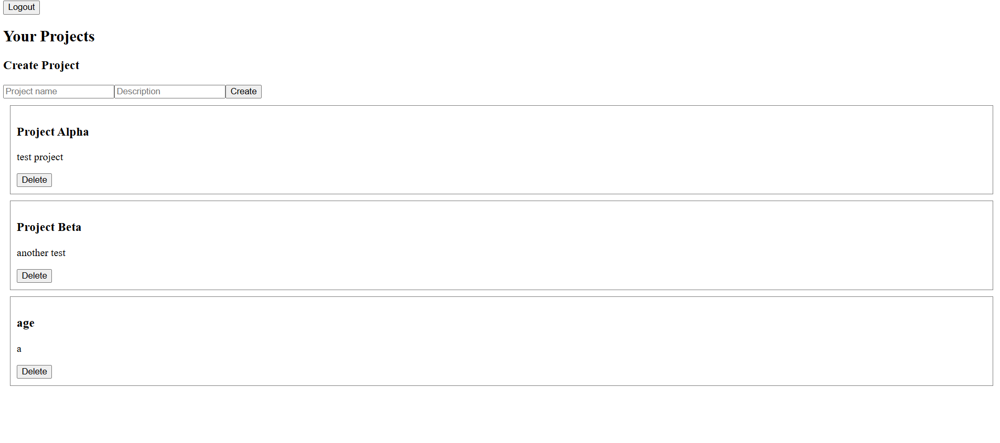
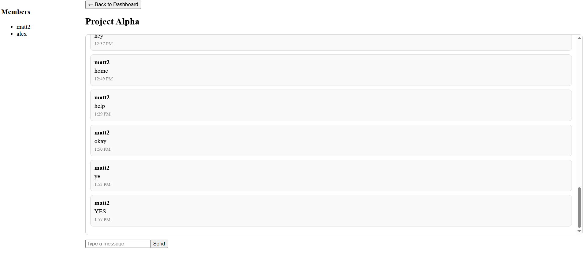

# DevCollab

A full-stack developer collaboration platform that enables teams to manage projects, assign tasks, and communicate in real-time.

---

## 🌐 Live Demo

👉 https://di1epd9vljwn.cloudfront.net

---

## 📌 Overview

DevCollab is a SaaS-style collaboration platform built using React, Express, PostgreSQL, JWT authentication, and Socket.IO.

The platform allows users to:
- create and manage projects
- collaborate with team members
- track work using a kanban-style task system
- communicate through real-time chat

This project demonstrates full-stack architecture, relational database design, authentication systems, and real-time WebSocket communication.

---

## 🚀 Features

### 🔐 Authentication
- Register new users
- Prevent duplicate accounts
- Login/logout functionality
- JWT-based authentication

### 📊 Dashboard
- View all user projects
- Create new projects
- Delete projects (owner only)

### 📁 Project Workspace
- Open project workspace
- View project metadata
- Edit project (owner only)

### 👥 Team Management
- Invite users to projects
- Accept/decline invites
- Remove members (owner only)
- Leave project (members)

### 📋 Task Management
- Create tasks
- Assign tasks to users
- Update task status:
  - Backlog
  - In Progress
  - Done
- Delete tasks (owner only)

### 💬 Real-Time Chat
- Send and receive messages instantly
- Load chat history
- Scrollable message interface

---

## 🛠 Tech Stack

### Frontend
- React (Vite)
- JavaScript

### Backend
- Node.js
- Express
- PostgreSQL
- Socket.IO

### Cloud / DevOps
- AWS S3 (frontend hosting)
- AWS CloudFront (CDN + routing)
- AWS ECS Fargate (backend)
- AWS Application Load Balancer (ALB)
- Amazon ECR (container registry)
- Docker

---

## 🏗 Architecture
Client (Browser)
↓
CloudFront (HTTPS)
↓
┌───────────────┐
│ │
S3 (Frontend) ALB (API)
↓
ECS Fargate
↓
PostgreSQL

- Static frontend served from **S3 via CloudFront**
- API and WebSocket traffic routed through **CloudFront → ALB → ECS**
- Backend handles authentication, projects, tasks, and messaging

---

## Screenshots

### Dashboard

### Project Chat

